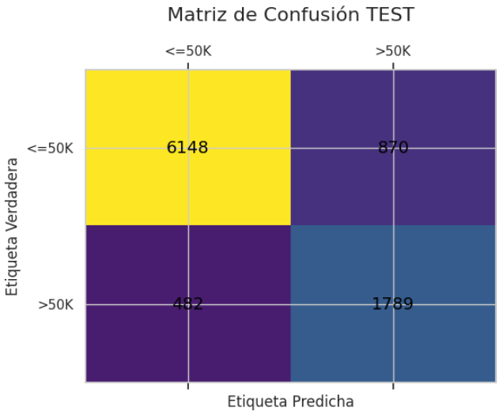
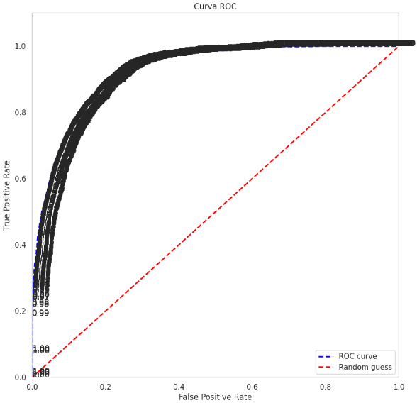

# Proyecto de Clasificación: Predicción de Ingresos Anuales

**Análisis Exploratorio, Feature Engineering, Modelado y Optimización con Scikit-Learn, Imbalanced-Learn y XGBoost**

## Descripción del Proyecto

Este proyecto aborda la tarea de clasificación para predecir si un individuo tiene ingresos anuales superiores a 50,000 dólares, utilizando datos del censo de 1994 (dataset "Adult Income"). El objetivo es desarrollar un modelo de Machine Learning robusto que maneje eficientemente las complejidades del dataset, incluyendo el desbalance de clases y la presencia de outliers.

El flujo de trabajo es integral, abarcando desde la adquisición de datos, limpieza exhaustiva y análisis exploratorio (EDA), hasta la ingeniería de características avanzada (reducción de cardinalidad y escalado robusto), entrenamiento de múltiples modelos de clasificación, optimización de hiperparámetros y una evaluación rigurosa, prestando especial atención a métricas adecuadas para datasets desbalanceados.

## Dataset

El conjunto de datos utilizado es el **"Adult"** (o "Census Income"), obtenido del [Repositorio de Machine Learning de UC Irvine](https://archive.ics.uci.edu/dataset/2/adult) a través de la librería `ucimlrepo`.

Contiene 15 atributos socioeconómicos extraídos del censo de 1994, tales como:
- `age`: Edad
- `workclass`: Tipo de empleo (privado, gobierno, etc.)
- `education`: Nivel educativo (texto)
- `education_num`: Nivel educativo (representación numérica)
- `marital_status`: Estado civil
- `occupation`: Ocupación
- `relationship`: Relación familiar
- `race`: Raza
- `sex`: Sexo
- `capital_gain`: Ganancias de capital
- `capital_loss`: Pérdidas de capital
- `hours_per_week`: Horas trabajadas por semana
- `native_country`: País de origen
- `income`: **Variable Objetivo** (binaria: `>50K` o `<=50K`)

## Metodología

El proyecto sigue una metodología estructurada:

1.  **Carga y Preparación Inicial de Datos:**
    -   Adquisición del dataset directamente desde UCI con `ucimlrepo`.
    -   Estandarización de nombres de columnas a `snake_case`.

2.  **Limpieza de Datos:**
    -   Identificación y manejo de valores faltantes (`?` y `NaN`) mediante la eliminación de las filas correspondientes, dado su bajo porcentaje.
    -   Eliminación de columnas irrelevantes o redundantes (`fnlwgt`, `education`).
    -   Normalización y codificación de la variable objetivo `income` a formato binario (0 y 1).

3.  **Análisis Exploratorio de Datos (EDA):**
    -   **Variables Numéricas:** Resumen estadístico, cálculo de rango y sesgo. Visualización de distribuciones (histogramas y boxplots) para identificar asimetrías y outliers significativos en `age`, `capital_gain`, `capital_loss`, `hours_per_week` y `education_num`.
    -   **Variables Categóricas:** Resumen estadístico (`describe(include='object')`). Visualización de la distribución de `income` por cada categoría para identificar patrones.
    -   **Desbalance de Clases:** Análisis del fuerte desbalance en la variable `income` (aprox. 75% `<=50K`, 25% `>50K`), lo que dirige la elección de métricas de evaluación y técnicas de mitigación.
    -   **Análisis de Correlación:**
        -   **Pearson:** Para variables numéricas, revelando correlaciones débiles a moderadas con `income`.
        -   **Cramér's V:** Para variables categóricas, evaluando la fuerza de asociación, especialmente entre `marital_status` y `relationship`.

4.  **Ingeniería de Características y Preprocesamiento:**
    -   **Reducción de Cardinalidad:** Agrupación estratégica de categorías en `workclass`, `occupation` y `native_country` para mejorar la capacidad de aprendizaje del modelo.
    -   **División de Datos:** El dataset se divide en conjuntos de entrenamiento (80%) y prueba (20%) utilizando `train_test_split` con `stratify` para mantener la proporción de la variable objetivo.
    -   **Pipelines de Preprocesamiento (`ColumnTransformer`):**
        -   **Variables Categóricas:** `OneHotEncoder` (con `drop='if_binary'` y `handle_unknown='ignore'`) para convertir a formato numérico.
        -   **Variables Numéricas:** `RobustScaler` se aplica a las características numéricas para escalarlas de manera robusta frente a outliers, lo cual es ideal para las distribuciones de variables como `capital_gain` y `capital_loss`.
    -   **Manejo del Desbalance (`SMOTE`):** Integración de `SMOTE` (Synthetic Minority Over-sampling Technique) dentro de los pipelines de `imblearn` para generar ejemplos sintéticos de la clase minoritaria (`>50K`) y equilibrar el dataset de entrenamiento.

5.  **Modelado y Selección del Mejor Modelo:**
    -   Se evalúan cuatro algoritmos de clasificación populares: **Decision Tree**, **K-Nearest Neighbors (KNN)**, **Random Forest** y **XGBoost**.
    -   **Optimización de Hiperparámetros:** Se utiliza `GridSearchCV` con validación cruzada de 5 folds para encontrar los hiperparámetros óptimos para cada modelo, empleando el **F1-Score** como métrica de optimización debido al desbalance de clases.
    -   **Selección Final:** **XGBoost** emerge como el modelo con el mejor `F1-Score` (0.717) en la validación cruzada, siendo seleccionado para la evaluación final.

6.  **Evaluación del Modelo Final (XGBoost):**
    -   El pipeline de XGBoost (incluyendo preprocesamiento y SMOTE) se entrena con los hiperparámetros óptimos en el conjunto de entrenamiento y se evalúa en el conjunto de prueba no visto.
    -   **Métricas de Evaluación:**
        -   `classification_report`: Proporciona `Precision`, `Recall` y `F1-Score` para ambas clases, así como la `accuracy` general.
        -   **Matriz de Confusión:** Visualiza el rendimiento del modelo, mostrando verdaderos positivos, verdaderos negativos, falsos positivos y falsos negativos.
        -   
            
            
        -   **Curva ROC y AUC:** Un `AUC de 0.93` confirma la excelente capacidad discriminativa del modelo.
            
            
    -   **Importancia de las Características:** Se analiza y visualiza la importancia de las variables en las predicciones del modelo, revelando que el estado civil (`marital_status_Married-civ-spouse`) es la característica más predictiva.
    -   **Análisis del Umbral de Decisión:** Se explora la elección del umbral óptimo utilizando el Índice de Youden y se discuten los trade-offs entre `Precision` y `Recall` según los objetivos de negocio. La conclusión es que el umbral por defecto (0.5) ofrece el mejor equilibrio para un modelo de propósito general.

## Conclusión Final

Este proyecto ha logrado con éxito desarrollar un modelo de Machine Learning robusto y de alto rendimiento para la predicción de ingresos anuales. Los hallazgos clave incluyen la confirmación de la hipótesis inicial sobre la influencia de factores socioeconómicos, la eficacia de **XGBoost** para manejar datos complejos y desbalanceados, y la importancia de técnicas como `SMOTE` y `RobustScaler` para obtener un modelo que generaliza bien.

**Aplicaciones Potenciales:**
-   **Segmentación de Clientes:** Identificación de clientes de alto valor.
-   **Evaluación de Riesgo Crediticio:** Mejora de modelos de scoring.
-   **Estudios Socioeconómicos:** Análisis de disparidades de ingresos.

**Próximos Pasos:**
-   **Despliegue:** Serialización del pipeline final (con `joblib` o `pickle`) para su integración en servicios API.
-   **Monitoreo y Mantenimiento:** Implementación de monitoreo continuo y re-entrenamiento periódico para asegurar la validez del modelo en producción.

## Cómo Usar

Para replicar este análisis, sigue estos pasos:

1.  **Clona el repositorio (o descarga los archivos):**
    ```bash
    git clone https://github.com/tu-usuario/tu-repositorio.git
    cd tu-repositorio
    ```

2.  **Instala las dependencias:**
    Asegúrate de tener Python instalado. Luego, instala las librerías necesarias ejecutando:
    ```bash
    pip install -r requirements.txt
    ```

3.  **Ejecuta el Notebook:**
    Inicia Jupyter Lab o Jupyter Notebook y abre el archivo `Adult_Income_ML_Clasificación.ipynb`.
    ```bash
    jupyter lab
    ```

## Dependencias

El proyecto requiere las siguientes librerías de Python:

-   `pandas`
-   `numpy`
-   `matplotlib`
-   `seaborn`
-   `scikit-learn`
-   `xgboost`
-   `ucimlrepo`
-   `imblearn`
-   `scipy`

Puedes instalarlas todas con el archivo `requirements.txt` proporcionado.
